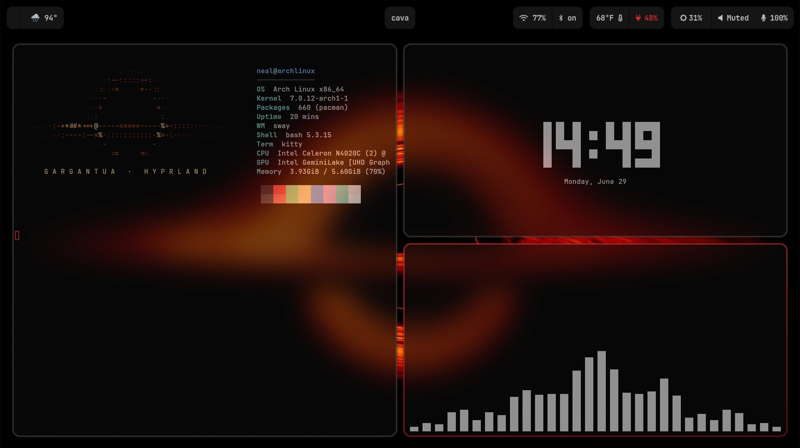

<div align="center">

# 🪐 Arch-Nemesis

### A clean, minimal Hyprland rice for Arch Linux


_Dotfiles + a one-shot install script to go from a bare Arch install to a working Wayland desktop._

</div>

---

## 📸 Screenshot




---

## ✨ What's inside

| Component         | Program                           |
| ----------------- | --------------------------------- |
| **Compositor**    | Hyprland                          |
| **Bar**           | Waybar                            |
| **Terminal**      | kitty                             |
| **Launcher**      | wofi                              |
| **Notifications** | mako                              |
| **Lock screen**   | swaylock-effects                  |
| **Logout menu**   | wlogout                           |
| **File manager**  | Thunar                            |
| **Wallpaper**     | swaybg                            |
| **Shell prompt**  | starship                          |
| **Screenshots**   | grim + slurp + swappy             |
| **Theme / Font**  | Dracula · JetBrainsMono Nerd Font |

---

## 🚀 Setup on a fresh Arch install

> Assumes you've already installed base Arch (e.g. with `archinstall`), created a user, and have a working internet connection. Run everything below as your **normal user**, not root.

### 1. Install prerequisites + `yay`

The install script uses the `yay` AUR helper, which isn't on a fresh system. Install it first:

```bash
sudo pacman -S --needed git base-devel
git clone https://aur.archlinux.org/yay.git
cd yay && makepkg -si && cd ..
```

### 2. Clone this repo

```bash
git clone https://github.com/ThomasDelamort/Arch-Nemesis.git
cd Arch-Nemesis
```

### 3. Run the install script

```bash
chmod +x set-hypr
./set-hypr
```

It will prompt you step by step — a sensible run is:

| Prompt                      | Answer                                       |
| --------------------------- | -------------------------------------------- |
| Disable wifi powersave?     | `y` (laptops)                                |
| Install the packages?       | `y`                                          |
| Copy config files?          | `y`                                          |
| Install the starship shell? | `y`                                          |
| Asus ROG software support?  | `y` **only** on an ASUS ROG laptop, else `n` |
| Start Hyprland now?         | `y`                                          |

That's it — you'll be dropped into Hyprland. On later boots, start it from a TTY with:

```bash
Hyprland
```

---

## 🔧 Manual install (if you'd rather not use the script)

```bash
# install everything
yay -S --needed hyprland kitty waybar \
  swaybg swaylock-effects wofi wlogout mako thunar \
  ttf-jetbrains-mono-nerd noto-fonts-emoji \
  polkit-gnome python-requests starship \
  swappy grim slurp pamixer brightnessctl gvfs \
  bluez bluez-utils lxappearance xfce4-settings \
  dracula-gtk-theme dracula-icons-git xdg-desktop-portal-hyprland

# copy configs into place
cp -R hypr kitty mako waybar swaylock wofi ~/.config/

# make scripts executable
chmod +x ~/.config/hypr/xdg-portal-hyprland
chmod +x ~/.config/waybar/scripts/waybar-wttr.py

# enable bluetooth
sudo systemctl enable --now bluetooth.service
```

---

## ⌨️ Keybindings

The mod key (`SUPER`) is the **Windows / ⌘ key**.

| Keys                        | Action                                       |
| --------------------------- | -------------------------------------------- |
| `SUPER` + `Q`               | Open terminal (kitty)                        |
| `SUPER` + `SPACE`           | App launcher (wofi)                          |
| `SUPER` + `E`               | File manager (Thunar)                        |
| `SUPER` + `C`               | Open VS Code                                 |
| `SUPER` + `SHIFT` + `X`     | Close active window                          |
| `SUPER` + `V`               | Toggle floating                              |
| `SUPER` + `F`               | Toggle fullscreen                            |
| `SUPER` + `S`               | Screenshot region → edit (grim/slurp/swappy) |
| `SUPER` + `L`               | Lock screen                                  |
| `SUPER` + `M`               | Logout menu                                  |
| `SUPER` + `SHIFT` + `M`     | Exit Hyprland                                |
| `SUPER` + `←↑↓→`            | Move focus                                   |
| `SUPER` + `1`–`0`           | Switch to workspace                          |
| `SUPER` + `SHIFT` + `1`–`0` | Move window to workspace                     |
| `SUPER` + drag              | Move (left) / resize (right) window          |
| `F3` / `F4` / `F5`          | Mute / volume down / volume up               |

---

## 🎨 Customizing

**Wallpaper** — set by `swaybg` in `~/.config/hypr/hyprland.conf`:

```ini
exec = swaybg -m fill -i ~/.config/hypr/hong-kong-night.jpg
```

Point that line at any image and reload Hyprland (`SUPER` + `SHIFT` + `M`, then log back in) — or apply it live without logging out:

```bash
pkill swaybg; swaybg -m fill -i ~/.config/hypr/your-wallpaper.jpg &
```

**Monitors** — edit the `monitor=` line at the top of `hyprland.conf`. The default `monitor=,preferred,auto,auto` auto-detects; a dual-monitor example is included (commented out).

---

## ⚠️ NVIDIA / Dell note

Intel and AMD graphics work out of the box. If your laptop has an **NVIDIA** GPU, Wayland needs extra setup (the `nvidia-dkms` driver + environment variables in `hyprland.conf`). Follow the current [Hyprland NVIDIA wiki](https://wiki.hyprland.org/Nvidia/) rather than a copy-pasted recipe. Check what you have with:

```bash
lspci | grep -E 'VGA|3D'
```

---

## 🙏 Credits

Based on [**SolDoesTech's Hyprland config**](https://github.com/SolDoesTech/hyprland). Tweaked with my own Waybar layout, weather script, and styling.

## 📄 License

MIT — see [`LICENSE`](./LICENSE). Check SolDoesTech's terms for anything reused from the original
